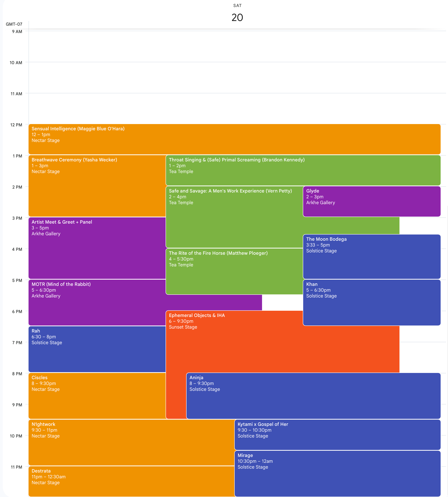
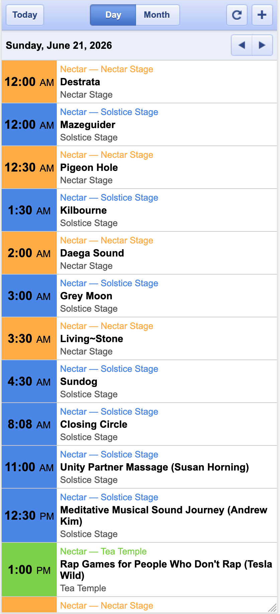
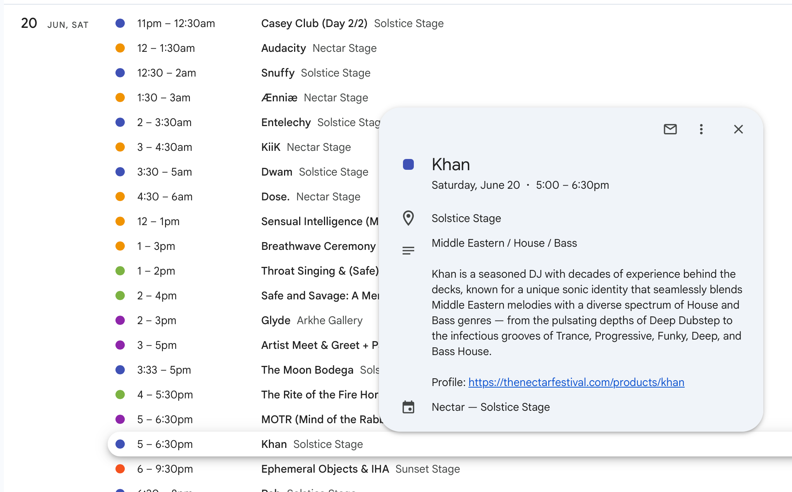

# Nectar Festival 2026 — Stage Calendars

The full [Nectar Festival 2026](https://thenectarfestival.com) lineup as subscribable calendar feeds — so the schedule lives right inside your own calendar app.

> ⚠️ **Unofficial.** I'm just an attendee, not a festival organizer. This is a personal, fan-made convenience — not an official Nectar Festival service. Always treat [thenectarfestival.com](https://thenectarfestival.com) as the authoritative source for the schedule.

Nectar Festival 2026 runs **June 18–22, 2026** on Salt Spring Island, BC. The program is split into **one calendar per stage** so you can colour-code them.

### Why it's handy

- Every set, talk, and ceremony as a properly-timed calendar event (82 in total across the five stages).
- Each event description packs in the artist's **genre, a short bio, their festival profile, and links to their music** (SoundCloud, Instagram, and the like).
- Tap an artist's music link to hear them in the moment and decide which set to catch in real time.
- Set reminders on the events you don't want to miss.

### What it looks like

  

  
  

## Subscribe

Pick your app, then add each stage you want using its URL below.

- **Google Calendar** — **＋ Add calendar → From URL**, paste the URL, click **Add calendar**.
- **Apple Calendar** — **File → New Calendar Subscription**, paste the URL. (On iPhone: **Settings → Calendar → Accounts → Add Account → Other → Add Subscribed Calendar**.)

| Stage | Subscribe URL | Suggested colour |
|---|---|---|
| Solstice Stage | `https://raw.githubusercontent.com/SsshirazzZ/nectar-calendars/main/nectar_solstice.ics` | Blueberry (deep blue) |
| Nectar Stage | `https://raw.githubusercontent.com/SsshirazzZ/nectar-calendars/main/nectar_nectar.ics` | Banana (gold) |
| Sunset Stage | `https://raw.githubusercontent.com/SsshirazzZ/nectar-calendars/main/nectar_sunset.ics` | Tangerine (orange) |
| Tea Temple | `https://raw.githubusercontent.com/SsshirazzZ/nectar-calendars/main/nectar_tea_temple.ics` | Avocado (yellow-green) |
| Arkhē Gallery | `https://raw.githubusercontent.com/SsshirazzZ/nectar-calendars/main/nectar_arkhe_gallery.ics` | Grape (purple) |
